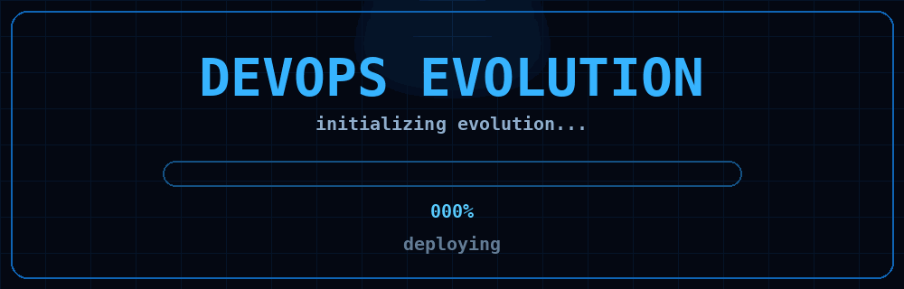

<h1 align="center">hey there 👋 I'm Aleksandra!</h1>

<h3>💫 About Me:</h3>

I am a Information Systems student and DevOps intern. I develop automations, applications, and operational solutions, working with infrastructure, data, and full-stack development. I am currently deepening my knowledge of Cloud, DevOps, and automation.

  

## <h3 align="left">📊 My Stats: </h3>

  
  

## <h3 align="left">💻 Languages:</h3>

  
  
  
  
  
  
  
  
  
  
  
  
  
  
  
  
  
  
  
  
  
  
  

## <h3 align="left">🛠 Tools:</h3>

  
  
  
  
  
  
  
  
  
  
  
  
  
  
  
  
  
  
  
  
  
  
  
  

## <h3 align="left">📲 Connect With Me:</h3>

 <a href="https://www.linkedin.com/in/aleksandra-leal" > <a/>
 <a href="mailto:aleksandramarto183@gmail.com" > <a/>
 <a href="https://discord.gg/tYhK8wFM" > <a/>
 <a href="https://www.instagram.com/mistynz_" > <a/>

##

  
  &nbsp;&nbsp;&nbsp;&nbsp;&nbsp;&nbsp;
  
  &nbsp;&nbsp;&nbsp;&nbsp;&nbsp;&nbsp;
  
  &nbsp;&nbsp;&nbsp;&nbsp;&nbsp;&nbsp;

